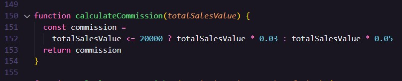
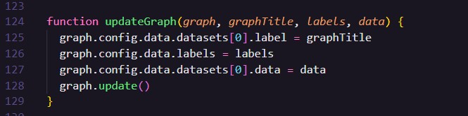

## Introdução – O que é um Dashboard de Vendas

Na análise de dados, Dashboard é o termo usado para se referir a um painel de dados, de onde se pode obter informações relevantes para um determinado tipo de negócio, facilitando a análise de dados. Por isso, cada painel de dados costuma ser customizados de acordo com o cenário em que será utilizado.

As informações em Dashboards podem ser apresentadas de diversas formas, mas normalmente a grande maioria exibem as principais informações por meio de indicadores chave de desempenho (KPI), métricas e pontos de dados. Desse modo, de acordo com o tipo de negócio e usuário final, busca-se utilizar a forma de apresentação de dados mais adequada, como por exemplo números, textos e gráficos (Hayward, 2021).

Dessa forma, um Dashboard de vendas é um painel de dados que exibirá indicadores, métricas e pontos de dados, com base em dados relacionados a vendas. Com isso, visto que os lucros de uma empresa normalmente se originam da venda de serviços ou produtos, um Dashboard de vendas, não somente para tomada de decisões referentes ao departamento de vendas, mas também outros, dependendo do tipo informação que se pode extrair.

## Motivação

A capacidade de tomar decisões rápidas e assertivas pode ser a diferença entre o crescimento de um negócio ou a sua falência, também em obter ou não vantagens competitivas. No entanto, isso se torna difícil para alguns profissionais quando a maioria dos dados estão espalhados em várias tabelas de dados diferentes.

A extração de informações de várias fontes diferentes de forma manual torna-se um processo tedioso e muitas vezes ineficiente (The, 2017), principalmente em um cenário atual que as empresas buscam armazenar a maior quantidade de dados que puderem, já que esses são tão valiosos que ficaram conhecidos como o “novo petróleo”, expressão usada pelo matemático Clive Humby (Dados, 2021). Com isso, sem as ferramentas adequadas como dashboards, acaba sendo difícil ter “uma visão do todo” e consequentemente isso também impacta a geração de relatórios.

### A importância de um Dashboard de vendas

Para a maioria das empresas, é necessário responder rapidamente a questões como:

- Qual o número total de vendas realizadas em um determinado período de tempo?
- Qual vendedor realizou o maior número de vendas atualmente?
- Qual o ticket médio de um vendedor ou equipe?
- Quanto foi a receita total obtida?
- Qual foi o produto mais vendido?

De fato, há uma série de questionamentos além desses que podem ser respondidos com a visualização e análise de um dashboard de vendas. Com base nessas respostas, pode-se identificar por exemplo se um produto está tendo um retorno esperado, pode-se verificar o desempenho dos vendedores e até mesmo obter informações sobre as suas comissões.
Tais informações não são apenas relevantes para motivar e “movimentar a equipe” de vendas (Muller, 2021), mas também para decidir sobre qual rumo a empresa deve tomar. É importante levar em consideração, que os dashboards buscam reunir as principais informações, apenas as mais importantes.

## Objetivo

Apresentar e exemplificar um estudo de caso de um dashboard de vendas.

## KPI, Métricas e Pontos de dados

Indicadores chave de performance ou KPI’s são ferramentas normalmente utilizadas para avaliar o desempenho de uma empresa e de seus funcionários em relação a uma meta. Em negócios, KPI’s de baixo nível são voltados para departamentos enquanto os de alto nível, para medir o desempenho de forma geral (What, 2022).

Já as métricas por sua vez, são a forma bruta desses indicadores e não costumam estar associadas a metas (Silva, 2021). Já os pontos de dados ou observação é o conjunto resultante de uma ou mais medições em um único membro de uma população estatística (What, 2022).

## Metodologias

Foram seguidas as informações disponibilizadas em PDF pelo SENAI para desenvolver o Dashboard de vendas solicitado.

### Conjunto de dados

Utilizou-se um conjunto de dados fornecido pelo SENAI (Serviço Nacional de Aprendizagem Industrial) contendo 6 amostras com informações relacionadas a vendas, contendo os seguintes atributos vendedor (nome do vendedor), número de vendas (número de vendas de cada vendedor), valor total (valor total de vendas de cada vendedor). Solicitou-se que os atributos comissão e ticket médio fossem calculados, com base no valor total e no número de vendas.

Forneceu-se as seguintes condições para se calcular o valor da comissão de cada vendedor:

1. Comissão de 3% para vendedores que atingirem vendas abaixo de R$ 20.000,00
2. Comissão de 5% para vendedores que atingirem vendas superiores de R$ 20.000,01

Como não foi especificado qual deveria ser o valor da comissão quando o total de vendas de um vendedor fosse exatamente igual a R$ 20.000,00 considerou-se a primeira condição, apesar do conjunto de dados não possuir um vendedor com comissão igual esse valor. Já o ticket médio foi calculado dividindo o valor total de vendas de cada vendedor pelo seu respectivo número de vendas (PAULILLO, 2021).

Considerou-se relevante apresentar a receita total, calculada somando o valor total de vendas de cada vendedor, o número total de vendas, calculado pela soma do número de venda de cada vendedor, o ticket médio da equipe, obtido dividindo a receita total pelo número total de vendas e por fim, a comissão total, resultante da soma das comissões individuais. Os dados foram armazenados em um arquivo local com nome **data** no formato JSON, pois atualmente é um dos formatos mais utilizados para trafegar dados na internet.

### Apresentação de dados

Os dados foram apresentados de duas formas, utilizando tabelas e gráficos. Utilizou-se gráficos de colunas, pois são uma alternativa recomendada para comparar valores independentes, uma vez que os leitores possuem uma facilidade maior para comparar o comprimento das barras, se comparado com a área de gráficos de pizza por exemplo (Nediger, 2021).

Uma tabela é composta somente pelos dados fornecidos e a outra, com os valores dos atributos comissão e ticket médio preenchidos. Já os gráficos são individuais para cada atributo e apresentam no eixo X os nomes dos vendedores e no Y os valores respectivos dos atributos numéricos de cada vendedor.

### Tecnologias

O dashboard de vendas foi desenvolvido utilizando:

- HTML
- CSS
- Javascript
- Bootstrap
- Chart JS (para criar e apresentar os gráficos).

## Descrevendo algumas das principais funções

### Cálculo da Comissão

**Retorno:** valor da comissão de cada vendedor

### Cálculo do Ticket Médio

**Retorno:** valor do ticket médio de cada vendedor

### Cálculo todas as comissões

**Retorno:** vetor com as comissões de todos os vendedores

### Cálculo de todos os tickets médio

**Retorno:** vetor com os tickets médio de todos os vendedores

### Obter o conteúdo do gráfico de comissões

**Retorno:** 2 arrays. O primeiro com o nome dos vendedores e o segundo com suas respectivas comissões

### Obter o conteúdo do gráfico de receita

**Retorno:** 2 arrays. O primeiro com o nome dos vendedores e o segundo com suas respectivas receitas

### Atualizar Gráfico

Essa função receberá como parâmetros:

- um array com os nomes dos vendedores, eixo X.
- um array com valores de um dos 4 atributos (comissão, ticket médio, valor total de vendas e o numero de vendas)

_Ela é a principal conexão com a livraria de gráficos_

### Gerar Tabela Completa de dados

## Resultados

Obteve-se como resultado um Dashboard de vendas que consome e apresenta os dados fornecidos e os solicitados, de forma gráfica.

## Referências

- Hayward, E. [What is a data dashboard?](https://www.klipfolio.com/blog/what-is-a-data-dashboard)Acesso em: 14 de maio 2022.
- [The importance of dashboards](https://clarivate.com/blog/the-importance-of-dashboards/#:~:text=These%20dashboards%20provide%20critical%20reporting,better%20navigating%20the%20surrounding%20landscape.) Acesso em: 15 de maio 2022.
- [Dados são o novo petróleo e sua empresa deveria estar preocupada com isso.](https://sevenit.com.br/dados-novo-petroleo/#:~:text=E%20isso%20somente%20se%20torna,buzzword%20a%20partir%20de%20ent%C3%A3o.) Acesso em 15 de maio 2022.
- Muller, J. [Dashboard de Vendas: O que é e como montar com perfeição.](https://leads2b.com/blog/dashboard-de-vendas/) Acesso em 15 de maio 2022.
- [What is a KPI?](https://www.klipfolio.com/resources/articles/what-is-a-key-performance-indicator). Acesso em 15 de maio 2021
- Silva, D. 2021. [Entenda a diferença entre métrica e KPI e saiba como usá-los para melhorar os resultados da sua empresa.](https://www.zendesk.com.br/blog/diferenca-entre-metrica-e-kpi/#:~:text=As%20m%C3%A9tricas%20permitem%20mensurar%2C%20monitorar,de%20forma%20num%C3%A9rica%20ou%20percentual.) Acesso em 15 de maio 2021
- [What are data points](https://www.buschsystems.com/resource-center/knowledgeBase/glossary/what-are-data-points) Acesso em 15 de maio 2021
- PAULILLO, J. [O que é ticket médio e como entender isso vai melhorar suas vendas.](https://www.agendor.com.br/blog/o-que-e-ticket-medio/) Acesso em 15 de maio 2022.
- Nediger, M. [Como escolher os melhores tipos de gráficos para os seus dados.](https://pt.venngage.com/blog/tipos-de-graficos/) Acesso em 15 de maio 2022.
